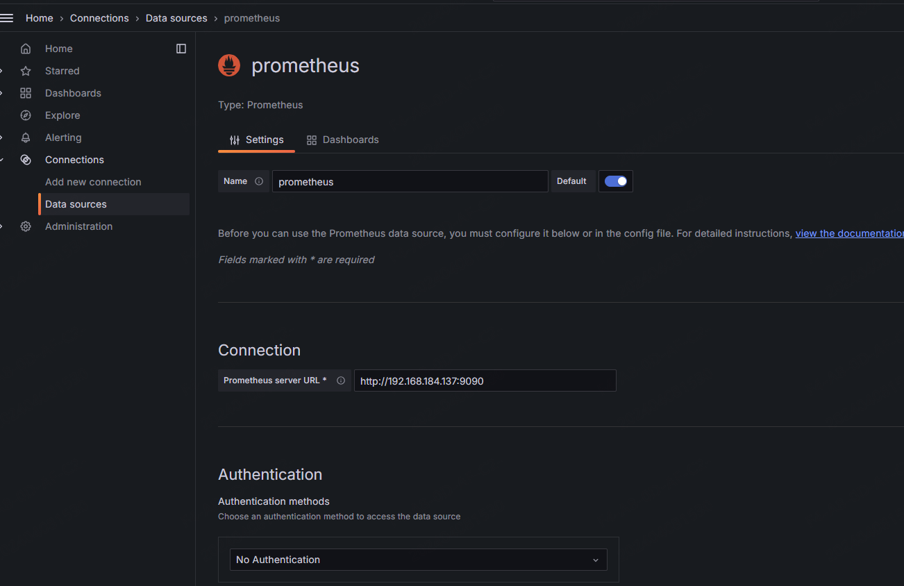
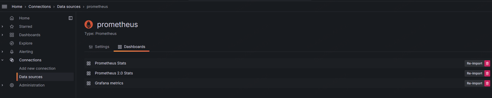
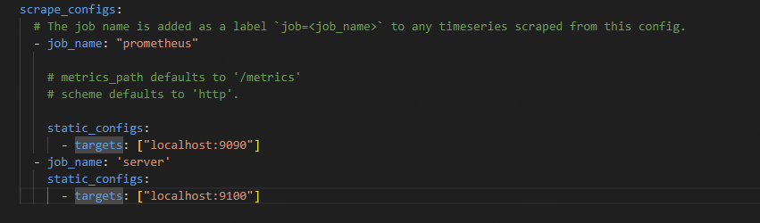
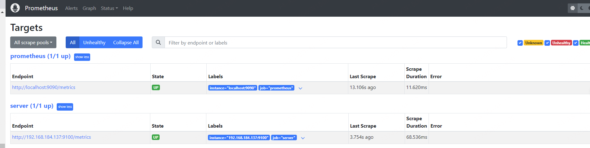
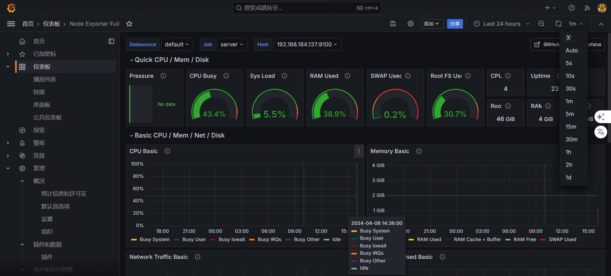

# 基于Prometheus搭建监控系统


## Prometheus介绍与搭建

参照上面的架构图，prometheus不止是监控系统，而且是个时序数据库。

prometheus采集数据的方式分为两种：

1. 如果要采集目标的监控数据，需要在目标处安装数据采集组件，这被称为exporter，它会在目标处收集监控数据，并且暴露一个HTTP接口供promethus查询，promutheus通过pull的方式采集数据。
2. 也可以将需要采集的数据推送到push gateway，prometheus通过pull的方式从push gateway获取数据。

prometheus server的主要作用是负责收集和存储数据指标，支持表达式查询和告警的生成。

### 安装prometheus

1. 开箱即用

   从官网获取最新的版本，https://prometheus.io/download/

   `wget https://github.com/prometheus/prometheus/releases/download/v2.45.4/prometheus-2.45.4.linux-amd64.tar.gz`

   `tar -zxvf prometheus-2.45.4.linux-amd64.tar.`gz

   切换到解压目录，检查Prometheus版本

   `[root@localhost tmp]# cd prometheus-2.45.4.linux-amd64`

   `[root@localhost prometheus-2.45.4.linux-amd64]# ls`

   `LICENSE  NOTICE  console_libraries  consoles  prometheus  prometheus.yml  promtool`

   `[root@localhost prometheus-2.45.4.linux-amd64]# ./prometheus --version`

   `prometheus, version 2.45.4 (branch: HEAD, revision: dff334450260a50c47b4b4274c3edc6bfb866c60)`
     `build user:       root@6b005e74c4f5`
     `build date:       20240318-10:58:43`
     `go version:       go1.21.8`
     `platform:         linux/amd64`
     `tags:             netgo,builtinassets,stringlabels`

   运行Prometheus程序

   `./prometheus --config.file=prometheus.yml`

2. docker方式运行

   `docker run -d -p 9090:9090 -v ~/Docker/prometheus.yml:/etc/prometheus/prometheus.yml prom/prometheus`

   这里通过 -v 参数将本地的配置文件挂载到容器中。如果不确定容器中Prometheus中默认的配置文件在哪，可以通过docker inspect 命令获取

### 配置Prometheus参数

Prometheus中的默认配置文件 Prometheus.yml 分为四大块：

- global：Prometheus的全局配置，比如 scrape_interval 表示Prometheus多久抓取一次数据，evaluation_interval 表示多久检测一次告警规则。
- alerting：关于alertmanger的配置；
- rule_file：告警规则；
- scrape_configs：定义了Prometheus需要抓取的目标，默认是配置了一个名为 Prometheus 的job，这是因为Prometheus在启动的时候也会通过http接口暴露自身的指标数据，相当于Prometheus自己监控自己。可以访问 http://localhost:9090/metrics 查看Prometheus暴露了哪些指标。

更多的配置参数可以参考https://prometheus.io/docs/prometheus/latest/configuration/configuration/

### 了解PromQL

Prometheus本身也提供了一个web ui方便我们操作，打开 http://localhost:9090/ 就可以访问。

默认会跳转到 Graph 界面。在Graph界面可以使用Prometheus提供的一种特殊表达式来查询监控数据，这个表达式就是PromQL。

在Prometheus的数据模型中，一条Prometheus数据由一个指标名称（metric）和N个标签（label，N>=0）组成。比如下面这条数据，

`promhttp_metric_handler_requests_total{code="200",instance="192.168.0.107:9090",job="prometheus"} 106`

这条数据的名称为 promhttp_metric_handler_requests_total， 并且包含三个标签 code, instance 和job，这条记录的值为106。之前说过，Prometheus是一个时序数据库，相同指标相同标签的数据构成一个时间序列。如果以传统数据库的概率来理解时序数据库，可以把指标名当作表名，标签是字段，timestamp是主键，还有一个float64类型的字段表示值。（关于指标和标签的命名，官网有一些指导性的建议，参考https://prometheus.io/docs/practices/naming/）

虽然Prometheus中存储的数据都是float64的数值，但是如果按照类型来分，可以把Prometheus的数据分为四大类：

- Counter
- Gauge
- Histogram
- Summary

Counter用于计数，例如：请求次数、错误发生数，这个值会一直增加，不会减少。

Gauge就是一般的数值，可大可小，例如：内存使用变化。

Histogram是直方图，或者称为柱状图，常用于跟踪事件发生的规模，例如：请求耗时、响应大小，它的特别之处在于可以对记录的内容进行分组，并且提供count和summary功能。

Summary和Histogram十分相似，也用于追踪事件发生的规模，不同之处在于，它提供了一个quantiles 的功能，可以按照百分比划分跟踪的结果，例如：quantile取值0.95，表示取采样值里面的95%数据，更多可以参考https://prometheus.io/docs/practices/histograms/

这四种类型的数据只是在指标的提供方作区别，也就是exporter，如果需要自己编写exporter或者在现有系统中暴露Prometheus抓取的指标，可以使用https://prometheus.io/docs/instrumenting/clientlibs/，这个时候就不需要考虑不同指标的数据类型了。

关于PromQL的更多资料，可以参考：

聚合操作：https://prometheus.io/docs/prometheus/latest/querying/operators/#aggregation-operators

内置函数：https://prometheus.io/docs/prometheus/latest/querying/functions/

PromQL VS Mysql：https://songjiayang.gitbooks.io/prometheus/content/promql/sql.html

更多例子：https://prometheus.io/docs/prometheus/latest/querying/examples/

除了在Graph页面查询PromQL，Prometheus还提供一种HTTP API的方式，可以更加灵活的将PromQL整合到其他系统中，譬如Grafana，就是通过Prometheus的HTTP API来查询指标数据的。

参考：https://prometheus.io/docs/prometheus/latest/querying/api/

## 安装Grafana

虽然Prometheus提供的web ui可以提供不同指标，但是要实现一个强大的监控系统，还需要一个能定制不同指标的面板，能支持不同类型的展示方法（饼状图，折线图等），这就是仪表盘功能，这就是Grafana的作用。

[Grafana](https://grafana.com/) 是一个用于可视化大型测量数据的开源系统，它的功能非常强大，界面也非常漂亮，使用它可以创建自定义的控制面板，你可以在面板中配置要显示的数据和显示方式，它 [支持很多不同的数据源](https://grafana.com/plugins?type=datasource)，比如：Graphite、InfluxDB、OpenTSDB、Elasticsearch、Prometheus 等，而且它也 [支持众多的插件](https://grafana.com/plugins)。

使用docker安装：

`docker run -d -p 3000:3000 grafana/grafana`

更多参数可以参考https://grafana.com/docs/grafana/latest/setup-grafana/installation/docker/

登陆之后使用默认的用户名和密码：admin/admin

然后add data source -> url 填入配置好的Prometheus的地址（http://localhost:9090）



然后到dashboard，import默认提供的三个面板：



至此，grafana和Prometheus的集成就已经完成，但是目前所收集的指标都不是我们所需要的，我们还需要配置exporter。

## 使用exporter收集指标

目前为止，我们看到的都还只是一些没有实际用途的指标，如果我们要在我们的生产环境真正使用 Prometheus，往往需要关注各种各样的指标，譬如服务器的 CPU负载、内存占用量、IO开销、入网和出网流量等等。正如上面所说，Prometheus 是使用 Pull 的方式来获取指标数据的，要让 Prometheus 从目标处获得数据，首先必须在目标上安装指标收集的程序，并暴露出 HTTP 接口供 Prometheus 查询，这个指标收集程序被称为 **Exporter**，不同的指标需要不同的 Exporter 来收集，目前已经有大量的 Exporter 可供使用，几乎囊括了我们常用的各种系统和软件，官网列出了一份 [常用 Exporter 的清单](https://prometheus.io/docs/instrumenting/exporters/)，各个 Exporter 都遵循一份端口约定，避免端口冲突，即从 9100 开始依次递增，这里是 [完整的 Exporter 端口列表](https://github.com/prometheus/prometheus/wiki/Default-port-allocations)。另外值得注意的是，有些软件和系统无需安装 Exporter，这是因为他们本身就提供了暴露 Prometheus 格式的指标数据的功能，比如 Kubernetes、Grafana、Etcd、Ceph 等。

### 收集服务器指标

首先我们来收集服务器的指标，这需要安装 [node_exporter](https://github.com/prometheus/node_exporter)，这个 exporter 用于收集 *NIX 内核的系统，如果你的服务器是 Windows，可以使用 [WMI exporter](https://github.com/martinlindhe/wmi_exporter)。

和 Prometheus server 一样，node_exporter 也是开箱即用的：

`wget https://github.com/prometheus/node_exporter/releases/download/v1.7.0/node_exporter-1.7.0.linux-amd64.tar.gz`

`tar -zxvf node_exporter-1.7.0.linux-amd64.tar.gz`

`./node_exporter`  

node_expoter启动之后，可以访问/metrics接口看看是否能正常获取服务器指标：

`curl http://localhost:9100/metrics`

如果一切 OK，我们可以修改 Prometheus 的配置文件，将服务器加到 `scrape_configs` 中：



修改配置后，需要重启 Prometheus 服务，或者发送 `HUP` 信号也可以让 Prometheus 重新加载配置：

`killall -HUP prometheus`

在 Prometheus Web UI 的 Status -> Targets 中，可以看到新加的服务器：



如果想在 Grafana 中查看服务器的指标，可以在 [Grafana 的 Dashboards 页面](https://grafana.com/dashboards) 搜索 `node exporter`，有很多的面板模板可以直接使用，譬如：[Node Exporter Server Metrics](https://grafana.com/dashboards/405) 或者 [Node Exporter Full](https://grafana.com/dashboards/1860) 等。我们打开 Grafana 的 **Import dashboard** 页面，输入面板的 URL（https://grafana.com/dashboards/1860）或者 ID（1860）即可。



一般情况下，node_exporter 都是直接运行在要收集指标的服务器上的，官方不推荐用 Docker 来运行 node_exporter。如果逼不得已一定要运行在 Docker 里，要特别注意，这是因为 Docker 的文件系统和网络都有自己的 namespace，收集的数据并不是宿主机真实的指标。可以使用一些变通的方法，比如运行 Docker 时加上下面这样的参数：

```
docker run -d \
  --net="host" \
  --pid="host" \
  -v "/:/host:ro,rslave" \
  quay.io/prometheus/node-exporter \
  --path.rootfs /host
```

关于 node_exporter 的更多信息，可以参考 [node_exporter 的文档](https://github.com/prometheus/node_exporter) 和 Prometheus 的官方指南 [Monitoring Linux host metrics with the Node Exporter](https://prometheus.io/docs/guides/node-exporter/)，另外，Julius Volz 的这篇文章 [How To Install Prometheus using Docker on Ubuntu 14.04](https://www.digitalocean.com/community/tutorials/how-to-install-prometheus-using-docker-on-ubuntu-14-04) 也是很好的入门材料。

### 收集nginx指标

官方提供了两种收集 Nginx 指标的方式。第一种是 [Nginx metric library](https://github.com/knyar/nginx-lua-prometheus)，这是一段 Lua 脚本（prometheus.lua），Nginx 需要开启 Lua 支持（libnginx-mod-http-lua 模块）。为方便起见，也可以使用 OpenResty 的 [OPM（OpenResty Package Manager）](https://opm.openresty.org/) 或者 [luarocks（The Lua package manager）](https://luarocks.org/modules/knyar/nginx-lua-prometheus) 来安装。第二种是 [Nginx VTS exporter](https://github.com/hnlq715/nginx-vts-exporter)，这种方式比第一种要强大的多，安装要更简单，支持的指标也更丰富，它依赖于 [nginx-module-vts 模块](https://github.com/vozlt/nginx-module-vts)，vts 模块可以提供大量的 Nginx 指标数据，可以通过 JSON、HTML 等形式查看这些指标。Nginx VTS exporter 就是通过抓取 `/status/format/json` 接口来将 vts 的数据格式转换为 Prometheus 的格式。不过，在 nginx-module-vts 最新的版本中增加了一个新接口：`/status/format/prometheus`，这个接口可以直接返回 Prometheus 的格式，从这点这也能看出 Prometheus 的影响力，估计 Nginx VTS exporter 很快就要退役了（TODO：待验证）。

除此之外，还有很多其他的方式来收集 Nginx 的指标，比如：[nginx_exporter](https://github.com/discordianfish/nginx_exporter) 通过抓取 Nginx 自带的统计页面 `/nginx_status` 可以获取一些比较简单的指标（需要开启 [ngx_http_stub_status_module 模块](http://nginx.org/en/docs/http/ngx_http_stub_status_module.html)）；[nginx_request_exporter](https://github.com/markuslindenberg/nginx_request_exporter) 通过 [syslog 协议](https://en.wikipedia.org/wiki/Syslog) 收集并分析 Nginx 的 access log 来统计 HTTP 请求相关的一些指标；[nginx-prometheus-shiny-exporter](https://github.com/serge-name/nginx-prometheus-shiny-exporter) 和 nginx_request_exporter 类似，也是使用 syslog 协议来收集 access log，不过它是使用 [Crystal 语言](https://github.com/serge-name/nginx-prometheus-shiny-exporter) 写的。还有 [vovolie/lua-nginx-prometheus](https://github.com/vovolie/lua-nginx-prometheus) 基于 Openresty、Prometheus、Consul、Grafana 实现了针对域名和 Endpoint 级别的流量统计。

有需要或感兴趣的同学可以对照说明文档自己安装体验下，这里就不一一尝试了。